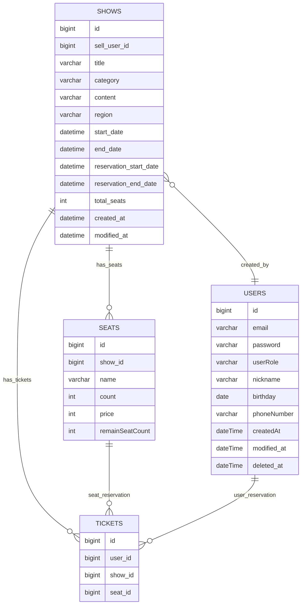

# 🎟 Ticketing Service

## 📌 개요
실시간 예매 서비스에서 발생할 수 있는 **동시성 이슈 해결**과 
**성능 최적화**를 위한 백엔드 중심의 티켓 예매 시스템.

## 🎯 목표
- Redis 기반 좌석 수량 제어 및 분산 락 처리로 동시성 문제 해결
- 어뷰징 및 매크로 방지를 위한 요청 제한 시스템 도입
- 사용자 역할에 따른 접근 제어 및 공연 관리 기능 제공
- Redis 기반의 분산락을 이용한 남은 좌석 수 관리
- JMeter를 이용한 성능 테스트 및 개선

##  ⭐️ 주요 기능
### 사용자 및 인증
- 회원가입 / 로그인
- 내 정보 조회 및 수정
- 사용자 역할(기획자/일반 사용자)에 따라 기능 차별화

### 공연 기능
- 기획자 전용: 공연 생성 / 수정 / 삭제 / 조회
- 예매 시작 전에는 공연 날짜 및 좌석 수 수정 가능

### 조회수 기능
- 공연 상세 조회 시 조회수 증가
- 매일 자정에 조회수 초기화
- 동일 유저의 반복 조회는 중복 카운팅 방지

### 예매 기능
- Redis에 좌석 이름별 수량 저장
- 예매 요청 시 Redis 분산 락(getLock) 적용으로 중복 예매 방지
- 예매 성공 시 DB 저장 + Redis 좌석 수량 감소
- 예매 취소 시 Redis 좌석 수량 증가 및 DB 정보 업데이트
- 예매 정보 조회

## 🛠 기술 스택
- Java 17
- Spring Boot 3.x
- Redis
- MySQL
- Gradle
- JMeter (성능 테스트용)

## 📑 API 명세서 (예시)
- [API명세서](API.md)


## 🗃 SQL 테이블
- [SQL](ticketing.sql)


## 🔑 Redis Key 전략

| Key 형식                               | 설명            |
|--------------------------------------|---------------|
| `"ticket:show: showId:seat: seatId` | 공연의 남은 티켓 수량  |
| `lock:show:showId:seat:seatId`       | 공연 예매 시 분산락   |
| `"viewCount:date`                    | 공연 상세 페이지 조회수 |
| `"view:show:showId:user:userId`      | 조회수 어뷰징 방지    |

## ERD


## 🧨 트러블슈팅

### 1. Redis FairLock → getLock 전략 변경

#### 🚨 문제점: Redisson의 `tryFairLock()` 사용 시 성능 저하 발생
- 공정성 보장은 됐지만, 락이 뒤로 밀려 **대기 시간이 길어짐**

<br>

#### 🔎 해결: 일반 `tryLock()`으로 변경하여 처리 우선순위 무시
- 예매 실패 시 예외 발생 → 재시도 유도
- Redis 분산락으로 간단하고 빠른 락 획득 가능


<br>

### 2. Docker의 Redis와 연결하는 과정에서 문제 발생 

#### 🚨 문제점: 레디스 기본 포트 6379로 연결 후 key 조회 시 빈 배열이 반환되는 문제

- `window redis가 먼저 연결되고 연결 해제를 하지 않은 상태`에서 **동일한 Port로 redis를 연결하면서 발생한 문제** 

<br>

#### 🔎 해결 : 포트를 6380으로 변경하여 해결

### 3. @Scheduled 중복 실행 문제 → ShedLock 적용

#### 🚨 문제점: 다중 인스턴스에서 `@Scheduled` 작업이 중복 실행되는 이슈 발생
- **스케일 아웃 환경**에서 자정마다 실행되는 조회수 초기화 스케줄러가 **여러 서버에서 동시에 실행**
- 그로 인해 **조회수가 여러 번 초기화되거나, 작업이 충돌**하는 문제가 발생

<br>

#### 🔎 해결: `ShedLock`을 이용한 분산락 기반 스케줄러 실행 제어
- `@SchedulerLock`을 통해 **동일한 작업을 하나의 인스턴스에서만 실행**되도록 제한
- **JDBC 기반 ShedLock** 적용으로 별도의 인프라 없이 손쉽게 관리
- **Redis 기반 ShedLock**도 병행 테스트하여 환경에 맞는 유연한 선택 가능

```java
@Scheduled(cron = "0 0 0 * * *") // 매일 자정
@SchedulerLock(name = "resetViewCount", lockAtMostFor = "10m", lockAtLeastFor = "1m")
public void resetViewCount() {
    viewCountService.resetAll(); // 조회수 초기화 작업
}